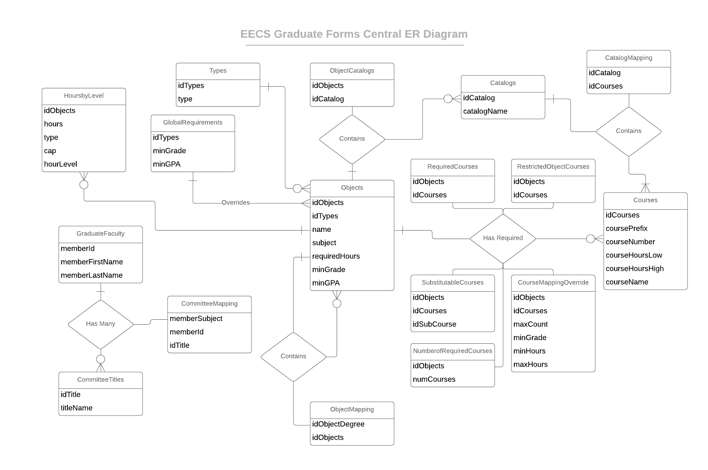

# 402Project EECS Graduate Student Forms Central

Project goal: implement a proof-of-concept for a better system for keeping track of graduate student requirements. This system will allow students to correctly understand degree program requirements and correctly fill out graduate school forms. The ideal final product is a system similar in functionality to the undergraduate DARs but expanded to incorporate the extra nuances of graduate school at UT.

## The Following is a Technical Report of EECS Graduate Student Forms Central, click on a list item to be taken to the section detailing the project implementation.
- ## [Database Design](#database) 

# Database 

MySQL Server 5.5 was utilized for this project. Initially a MySQL 8 database was used; however, a bug with the version and character encodings caused Ajax requests to be improperly recieved by the client. A sql dump file can be found in the resources folder of this project. The following is a modified ER Diagram that details the database design. This diagram is *modified* in the sense that tables that are relationships are shown. This is done in order to help identify which tables serve which function.

At the center of this diagram is the Objects entity. This is at the center of the diagram because this is the focal point of the application design. 
### Objects Entity 
Each entry in the Objects relation corresponds to some degree program entity. Each object must be of some type specified in the *Type* entity. Example types include:
- Masters
- PhD
- Certificate 
- Form
- Minor 

These types are used to distinguish between what object is being represented by the table entry. The rationale behind this design decision is simple: Degree Programs can have requirements in the same way as Minors or Forms; therefor, utilize the same requirements system for all these entities. In this way the database design is simplified.
### Catalogs Entity
A degree program would be nothing without a selection of courses to take. This is where the catalog system comes into play. An object can be assigned any number of catalogs. The relationship between the *Objects* entity and the *Catalogs* entity is thusly 0 to many. The catalog system is in place to add a layer to manage what courses are applicable to what major, much the same as EECS graduate students can choose courses from either the Electrical Engineering or Computer Science Catalogs. Objects therefor do not have courses, but rather they have catalogs that have courses.
### Courses Entity
This is where information regarding individual courses is stored. This information includes the course name, prefix, and credit hour information. While Objects may not directly have courses, they do directly have required courses. There are 5 entities that constitute the *has required* relationship between Objects and Courses:
- RestrictedObjectCourses
- RequiredCourses
- SubstitutableCourses
- CourseMappingOverride
- NumberofRequiredCourses

These tables were created out of necessity to support increasing course requirements for each degree program. For example, a course inside a catalog will have its information such as the minimum number of credit hours; however, this number may need to be increased by a degree program. In the Graduate Catalog the COSC 500 Thesis course is listed as 1-15 hours, but the minimum hour requirement for the Computer Science Masters Thesis option requires at least 6 hours of Thesis credit. This is where the *CourseMappingOverride* relation comes into play. It will allow course information to be overridden for a specific object - allowing a requirement to be set for the Thesis course to be at least 6 credit hours. Additionally an object may set a course a required for completion, but this required course may need to be either COSC 580 or COSC 581 for example. COSC 580 can be set as required in the *RequiredCourses* relation and have COSC 581 set as a substitute in *SubstitutableCourses*. 

*RestrictedObjectCourses* is necessary in instances where an Object such as a Minor may not desire to have an entire catalog be creditable towards its hour requirement. In this case the Minor can set courses to be part of its *RestrictedObjectCourses* and only these courses will be applicable to fufilling hour requirements. Finally the *NumberofRequiredCourses* allows an Object to further restrict the courses requirements. For example some Minors have requirements such as "Choose 3 of the following 5 courses". The *NumberofRequiredCourses* allows for this. *NumberofRequiredCourses* in conjunction with the *RestrictedObjectCourses* requirement configurations can support restricting a catalog to a subset of courses and requiring a certain number of an even more strictly defined subset of courses to be taken. 
### ObjectMapping Relationship
This relation defines the relationship that Objects can have with itself. Take for example a Masters program such as Computer Science Thesis option. This program may want to have a certificate be attached to the program so that whenever the database is queried for the requirements for Computer Science Thesis the information for the certificate can also be retrieved. This is where *ObjectMapping* performs its function of allowing objects to be mapped to each other.
### GlobalRequirements Entity
Also thought of as University requirements, this table allows for global requirements to be enforced for each different type of Object. For example the global requirement for PhD may enforce a minimum grade of B. Whenever information is retrieved from the database for a PhD then the global requirement relation can be queried to see if an objects individual requirements conforms with the global requirements. 
### HoursbyLevel Entity 
