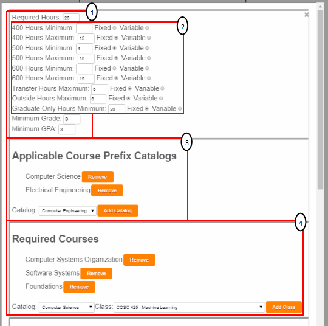
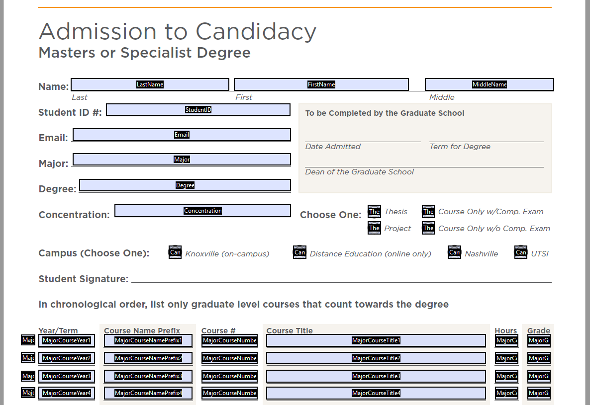

# 402Project EECS Graduate Student Forms Central

Project goal: implement a proof-of-concept for a better system for keeping track of graduate student requirements. This system will allow students to correctly understand degree program requirements and correctly fill out graduate school forms. The ideal final product is a system similar in functionality to the undergraduate DARs but expanded to incorporate the extra nuances of graduate school at UT.

## The Following is a Technical Report of EECS Graduate Student Forms Central, click on a list item to be taken to the section detailing the project implementation.
- ## [Server Setup](#setup)
- ## [Database Design](#database) 
- ## [Student Page](#studentpage)
- ## [Staff Page](#staffpage)
- ## [PDF Population With PDF Toolkit](#pdfimplementation)

# Setup

The environment used throughout the development is as follows:
- MySQL Server 5.5 https://dev.mysql.com/downloads/mysql/5.5.html
- XAMMP (PHP enabled) https://www.apachefriends.org/index.html
- PDFtoolkit Server https://www.pdflabs.com/tools/pdftk-server/

Any PHP enabled webserver can be used to host the website; however, the proceeding environment setup will describe how the application was configured with XAMMP. Firstly, the MySQL server should be running and open to connections. A MySQL dump file can be found in the resources of this project. This dump file can be used to populate the database. The specification for what database the server uses can be found in *DatabaseInfo.php*. Install XAMMP and ensure PHP is enabled (the setup wizard enables PHP by default). The htdocs folder in XAMMP is where the repository should be placed. With the repository in htdocs the web application can simply be visited at localhost/402Project. 
### PDFtoolkit Server
In order for the PDF form automatic population to function properly PDFtoolkit Server should be installed and added to the Path. 
### Database connection
The file *DatabaseInfo.php* specifies which database the application will use. Change the information in the file to point to the MySQL database.

# Database 

MySQL Server 5.5 was utilized for this project. Initially a MySQL 8 database was used; however, a bug with the version and character encodings caused Ajax requests to be improperly recieved by the client. A sql dump file can be found in the resources folder of this project. The following is a modified ER Diagram that details the database design. This diagram is *modified* in the sense that tables that are relationships are shown. This is done in order to help identify which tables serve which function.


At the center of this diagram is the Objects entity. This is at the center of the diagram because this is the focal point of the application design. 
### Objects Entity 
Each entry in the Objects relation corresponds to some degree program entity. Each object must be of some type specified in the *Type* entity. Example types include:
- Masters
- PhD
- Certificate 
- Form
- Minor 

These types are used to distinguish between what object is being represented by the table entry. The rationale behind this design decision is simple: Degree Programs can have requirements in the same way as Minors or Forms; therefor, utilize the same requirements system for all these entities. In this way the database design is simplified.
### Catalogs Entity
A degree program would be nothing without a selection of courses to take. This is where the catalog system comes into play. An object can be assigned any number of catalogs. The relationship between the *Objects* entity and the *Catalogs* entity is thusly 0 to many. The catalog system is in place to add a layer to manage what courses are applicable to what major, much the same as EECS graduate students can choose courses from either the Electrical Engineering or Computer Science Catalogs. Objects therefor do not have courses, but rather they have catalogs that have courses.
### Courses Entity
This is where information regarding individual courses is stored. This information includes the course name, prefix, and credit hour information. While Objects may not directly have courses, they do directly have required courses. There are 5 entities that constitute the *has required* relationship between Objects and Courses:
- RestrictedObjectCourses
- RequiredCourses
- SubstitutableCourses
- CourseMappingOverride
- NumberofRequiredCourses

These tables were created out of necessity to support increasing course requirements for each degree program. For example, a course inside a catalog will have its information such as the minimum number of credit hours; however, this number may need to be increased by a degree program. In the Graduate Catalog the COSC 500 Thesis course is listed as 1-15 hours, but the minimum hour requirement for the Computer Science Masters Thesis option requires at least 6 hours of Thesis credit. This is where the *CourseMappingOverride* relation comes into play. It will allow course information to be overridden for a specific object - allowing a requirement to be set for the Thesis course to be at least 6 credit hours. Additionally an object may set a course a required for completion, but this required course may need to be either COSC 580 or COSC 581 for example. COSC 580 can be set as required in the *RequiredCourses* relation and have COSC 581 set as a substitute in *SubstitutableCourses*. 

*RestrictedObjectCourses* is necessary in instances where an Object such as a Minor may not desire to have an entire catalog be creditable towards its hour requirement. In this case the Minor can set courses to be part of its *RestrictedObjectCourses* and only these courses will be applicable to fufilling hour requirements. Finally the *NumberofRequiredCourses* allows an Object to further restrict the courses requirements. For example some Minors have requirements such as "Choose 3 of the following 5 courses". The *NumberofRequiredCourses* allows for this. *NumberofRequiredCourses* in conjunction with the *RestrictedObjectCourses* requirement configurations can support restricting a catalog to a subset of courses and requiring a certain number of an even more strictly defined subset of courses to be taken. 
### ObjectMapping Relationship
This relation defines the relationship that Objects can have with itself. Take for example a Masters program such as Computer Science Thesis option. This program may want to have a certificate be attached to the program so that whenever the database is queried for the requirements for Computer Science Thesis the information for the certificate can also be retrieved. This is where *ObjectMapping* performs its function of allowing objects to be mapped to each other.
### GlobalRequirements Entity
Also thought of as University requirements, this table allows for global requirements to be enforced for each different type of Object. For example the global requirement for PhD may enforce a minimum grade of B. Whenever information is retrieved from the database for a PhD then the global requirement relation can be queried to see if an objects individual requirements conforms with the global requirements. 
### HoursbyLevel Entity 
This table handles the hour restrictions for specific course levels such as 400, 500, and 600 level hours. Originally designed to support just these three hour restrictions, this table was later extended to support PhD exclusive, transfer, and outside department hours. Fields of note in the relation are *type* and *cap*. The *cap* field can be either "maximum" or "minimum" and as the name implies these are used to distinguish a maximum hour restriction from a minimum restriction. The *type* field was added later in development to accomodate both *fixed* and *variable* hours. *Fixed* is intended to signify that an hour requirement does not change when the number of hours applied to a degree exceed the maximum. As an example between the differences between *fixed* and *variable* consider a program with a required hour count of 30 hours. With a *fixed* 400-level hour minimum of 10 hours, even if 40 hours are applied to the degree then the hour minimum would still be maintained at 10 hours. On the other hand a *variable* 400-level hour minimum could be applied instead. The hour minimum would be 10 hours up until the required 30 hours is met. Any more hours applied will increase the hours minimum to be 1/3 of the total hours applied above the minimum hour requirement. 
### GraduateFaculty Entity
For forms such as the Admission to Candidacy Form there are committee members that must be selected. The approved members come from the GraduateFaculty relation. The *GraduateFaculty* entity is related to the *CommitteeTitles* and *CommitteeMapping* relations. Members of the graduate faculty can be appointed to different titles for different subjects. This is where the *CommitteeMapping* relation comes into play. A member may be mapped to a specific subject with an approved title that comes form the *CommitteeTitles* relation. In this way faculty may be approved to be ChairPersons on graduate committees or simply serve only as members. 
# StudentPage
The core script for the student page is Requirements.php. This script will return all the information associated with a degree program's requirements. This also includes all requirements for any objects that are mapped to the degree program (such as Minors or Certificates). An example of how the object returned to the client by Requirements.php is given below.


The returned object contains array fields for 
- Catalogs (Contains the names of all catalogs applicable to the degree)
- Certificate (Array of all certificates and their requirements)
- Form (Array of all forms and their requirements)
- Minor (Array of all minors and their requirements)

Each entry in the Certificate, Form, and Minor arrays corresponds to an individual certificate, form, or minor. The structure of the entries in these arrays is the same as the structure shown for the Degree Program. When all this information is retrieved from the server then the webpage processes and displays the information. The design for requirement processing is illustrated below.


The central point of requirement processing is the *Requirement* class inside the *Requirement.js* file. This class contains all the methods required to manage object requirements. When the requirements are loaded onto the client, each object is processed into the *Requirement* object. Specifically, a *Requirement* object is created for the Degree Program and for each Certificate, Form, and Minor attached to the Degree Program. Once all these *Requirement* objects are configured with each degree object's requirements, these *Requirement* objects are subscribed to the *CourseObserver*. 
### Course Addition and Removal Events
The functionality of the student page centers around a student submitting a course that he or she has taken. In the same way a student can remove a course from his or her history. These are the events that are broadcasted to each *Requirement* object by the *CourseObserver*. When a course is added then the information for that course is processed by all *Requirement* objects to which the course may be applied. For example, a student may submit the course COSC 500. The Degree Program *Requirement* may be configured to where this course counts towards completing the program; however, the Interdisciplinary Graduate Minor in Computational Science will reject this course as it is neither a required course or creditable course. 
### Requirement Event Handling 
The *Requirement* objects themselves support attaching event handlers for several different events such as:
- Maximum hour by course level violation
- Required course addition and removal 
- Creditable course addition and removal 
- Manual course entry (courses not available in the program's catalog)

For a full description of all events supported by the *Requirement* object see the documentation in *Requirement.js* 
# StaffPage
The staff page refers to the user interface where modifications to degree programs can be made. The design for this side of the application centered around building an interface to easily add, delete, and adjust degree program requirements, i.e., adjust to relations shown in the ER diagram included in the Database section. There are numerous tables to interact with and edit, so the development decision was to incorporate save scripts for each section of degree program modification that adjusted a single relation in the database. An example breakdown of this shown below. 



Using the above image as a guiding example consider section number 1. This section allows the *Required Hours*, *Minimum Grade*, and *Minimum GPA* to be altered for a degree Object. Refering back to the ER diagram presented above, these three fields are included in the *Objects* relation. The save script that will save modifications to these fields thusly only operates on the one table *Objects*. Similarly section 2 changes the fields stored in the *HoursbyLevel* relation and the script to save these changes therefor only operates on the *HoursbyLevel* relation. 
### Modification Tracking 
Cearly the webpage should not submit information to the server if no modifications have been made, therefor, a system is in place to determine if any modifications are made. Section numbers 1 and 2 use a system where the old value is stored internally. If the save button is pressed then JavaScript is run to determine if any of the new values differ from the old values (the values stored in the database). Sections 3 and 4 (as well as the other modification fields not shown in this image) operate under a differnt system. For each of these sections there are two arrays that correspond to removal and addition events. The required courses section (4) for example has two arrays: removedCourses and addedCourses. Whenever a course is added by the user the course will be added to the addedCourses array and likewise for removed courses. The caveat here is what happens if an added course is removed before saving? To handle these conditions whenever a course is added the removedCourses array is checked to see if that course was previously removed. In which case the course is removed from the removedCourses array and not added to the addedCourses array (vice versa for course removals). 
# PDFImplementation
### Background
Automatically populating PDF files was the most interesting challenge for this project. The PDF files of interest are the Admission to Candidacy PhD and Masters forms. These forms as they are retrieved from UT's Forms Central webpage are Adobe Acrobat PDF files. The functionality that one gets when opening one of these files with a web browser is that the PDF form fields can be filled by simply selecting the field and typing. Unfortunately, automating that process is not simple.

The main hurdle to surmount is interacting with Adobe's proprietary API. This is not a hurdle simply for this project but a hurdle for common browsers as well. Adobe Acrobat PDF Forms offer a wide range of interactability such as running JavaScript inside the form; however, most browsers only support a handful of Adobe PDF functionality if at all. An approach that embeds JavaScript into the PDF and imports the data from the webpage directly into the PDF is therefor not an option. (As a side not some browsers support plugins for Adobe; however, some browsers no longer support these plugins such as Chrome).

Server side solutions were investigated and, in order to avoid a large pricetag, the free utility PDF Toolkit Server was used. (As another side note: a common server side solution would be to use FDFMerge; however, this can run up a pricetag of several hundred dollars).
### PDF Toolkit: How it works
In short PDF Toolkit works by taking an FDF file and using it to fill in the fields of an Adobe PDF Form. As for what an FDF file is, it is essentially a file format invented by Adobe in order to perform tasks such as importing and exporting Adobe PDF Form data. The general format of an FDF is 
```
%FDF-1.2
%âãÏÓ
1 0 obj
<</FDF<</F(Admission to Candidacy Masters.pdf)/Fields[<</T(Campus)/V/Off>><</T(List Box1)/V(sdasdfasdfsd)>><</T(ThesisType)/V/Off>>]/ID[<053AA5E0F20E814F8074563A432B6542><22D42210C6010240BDC53886B8D8D77B>]/UF(Admission to Candidacy Masters.pdf)>>/Type/Catalog>>
endobj
trailer
<</Root 1 0 R>>
%%EOF
```
As is shown above each form field is denoted by a key/value pair of the form <<//T(Key)/V(Value)>>. The name that is the *Key* is determined by the name of the form field. Below is a screenshot detailing the naming convention used for form fields.

